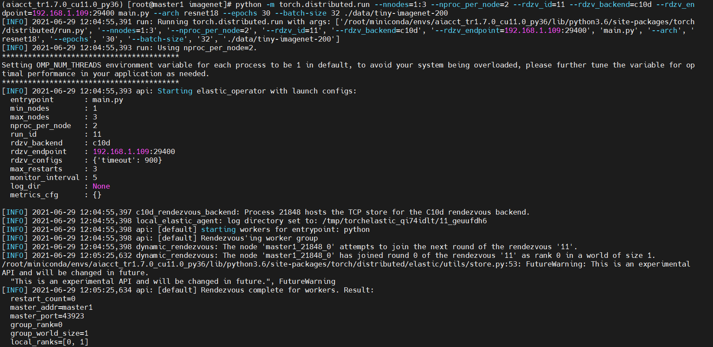
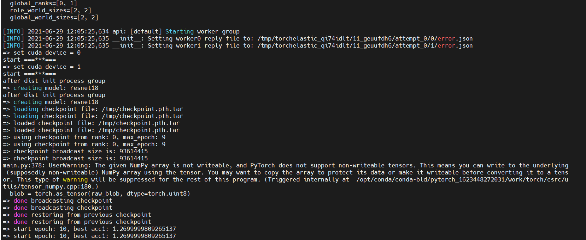
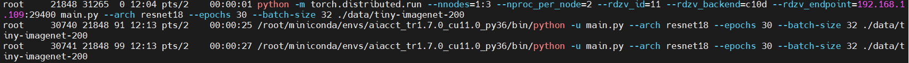
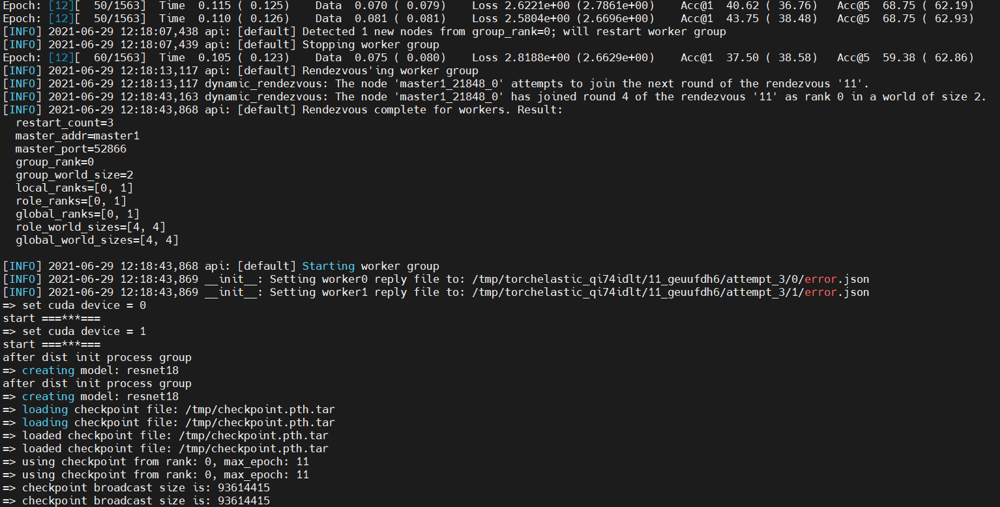

```
pip3 install torch==1.9.0+cu111 torchvision==0.10.0+cu111 torchaudio==0.9.0 -f https://download.pytorch.org/whl/torch_stable.html
```

/root/miniconda/envs/aiacct_tr1.7.0_cu11.0_py36/lib/python3.6/site-packages/torch/distributed/

```
print('当前函数名称:', sys._getframe().f_code.co_name)
print(f"当前函数名：{sys._getframe().f_code.co_name}")
print(f'当前类名称：{self.__class__.__name__}')

import sys
import logging
log = logging.getLogger(__name__)

log.debug(f" =====> 当前类名称：{self.__class__.__name__}")
log.debug(f" =====> 当前函数名：{sys._getframe().f_code.co_name}")
```


## 1. 单节点

```
python -m torch.distributed.run --nnodes=1 --nproc_per_node=1 \
--standalone \
main1.9.py --arch resnet18 --epochs 20 --batch-size 32 ./data/tiny-imagenet-200
```


```
python -m torch.distributed.run --nnodes=1 --nproc_per_node=1 \
--standalone \
main1.9.py --arch=resnet18 --epochs=20 --batch-size=32 ./data/tiny-imagenet-200
```

registry.cn-beijing.aliyuncs.com/ecs-kube/torch1.9:elastic-1

args: ["--arch=resnet18", "--epochs=20", "--batch-size=32", "./data/tiny-imagenet-200"]

command:
                - "python"
                                - "main1.9.py"
                                - "--arch=resnet18"
                                                - "--epochs=20"
                                                - "--batch-size=32"
                                                                - "./data/tiny-imagenet-200"

imagePullPolicy: IfNotPresent


=> set cuda device = 0
Traceback (most recent call last):
  File "/workspace/main1.9.py", line 596, in <module>
    main()
  File "/workspace/main1.9.py", line 158, in main
    backend=args.dist_backend, init_method="env://", timeout=timedelta(seconds=10)
  File "/opt/conda/lib/python3.7/site-packages/torch/distributed/distributed_c10d.py", line 547, in init_process_group
    _store_based_barrier(rank, store, timeout)
  File "/opt/conda/lib/python3.7/site-packages/torch/distributed/distributed_c10d.py", line 222, in _store_based_barrier
    rank, store_key, world_size, worker_count, timeout))
RuntimeError: Timed out initializing process group in store based barrier on rank: 0, for key: store_based_barrier_key:1 (world_size=2, worker_count=1, timeout=0:00:10)


Downloading http://fashion-mnist.s3-website.eu-central-1.amazonaws.com/train-images-idx3-ubyte.gz
Downloading http://fashion-mnist.s3-website.eu-central-1.amazonaws.com/train-labels-idx1-ubyte.gz
Downloading http://fashion-mnist.s3-website.eu-central-1.amazonaws.com/t10k-images-idx3-ubyte.gz

root@pytorch-dist-mnist-gloo-master-0:/opt/mnist/data/raw# ls
t10k-images-idx3-ubyte.gz  train-images-idx3-ubyte  train-labels-idx1-ubyte


Traceback (most recent call last):
  File "/home/du/miniconda3/bin/ecluster", line 1495, in <module>
    main()
  File "/home/du/miniconda3/bin/ecluster", line 1491, in main
    COMMANDS[mode](sys_argv)
  File "/home/du/miniconda3/bin/ecluster", line 1313, in k8s
    worker_list.append(instance.instance_name())
AttributeError: 'str' object has no attribute 'append'

> /home/du/miniconda3/bin/ecluster(1313)k8s()
> -> worker_list.append(instance.instance_name())


## 2. 固定节点启动


```
python -m torch.distributed.run --nnodes=2 --nproc_per_node=2 \
--rdzv_id=11 --rdzv_backend=c10d --rdzv_endpoint=192.168.29.210:29400 \
main.py --arch resnet18 --epochs 30 --batch-size 32 ./data/tiny-imagenet-200
```


##  3. 弹性启动

```
python -m torch.distributed.run --nnodes=1:3 --nproc_per_node=2 \
--rdzv_id=11 --rdzv_backend=c10d --rdzv_endpoint=192.168.29.210:29400 \
main.py --arch resnet18 --epochs 30 --batch-size 32 ./data/tiny-imagenet-200
```

### 3.1 只在节点1上运行





查看python进程



(aiacct_tr1.7.0_cu11.0_py36) [root@master1 imagenet]# python -m torch.distributed.run --nnodes=1:3 --nproc_per_node=2 --rdzv_id=11 --rdzv_backend=c10d --rdzv_endpoint=192.168.1.109:29400 main.py --arch resnet18 --epochs 30 --batch-size 32 ./data/tiny-imagenet-200
[INFO] 2021-06-29 12:04:55,391 run: Running torch.distributed.run with args: ['/root/miniconda/envs/aiacct_tr1.7.0_cu11.0_py36/lib/python3.6/site-packages/torch/distributed/run.py', '--nnodes=1:3', '--nproc_per_node=2', '--rdzv_id=11', '--rdzv_backend=c10d', '--rdzv_endpoint=192.168.1.109:29400', 'main.py', '--arch', 'resnet18', '--epochs', '30', '--batch-size', '32', './data/tiny-imagenet-200']
[INFO] 2021-06-29 12:04:55,393 run: Using nproc_per_node=2.

*****************************************

Setting OMP_NUM_THREADS environment variable for each process to be 1 in default, to avoid your system being overloaded, please further tune the variable for optimal performance in your application as needed.

*****************************************

[INFO] 2021-06-29 12:04:55,393 api: Starting elastic_operator with launch configs:
  entrypoint       : main.py
  min_nodes        : 1
  max_nodes        : 3
  nproc_per_node   : 2
  run_id           : 11
  rdzv_backend     : c10d
  rdzv_endpoint    : 192.168.1.109:29400
  rdzv_configs     : {'timeout': 900}
  max_restarts     : 3
  monitor_interval : 5
  log_dir          : None
  metrics_cfg      : {}

[INFO] 2021-06-29 12:04:55,397 c10d_rendezvous_backend: Process 21848 hosts the TCP store for the C10d rendezvous backend.
[INFO] 2021-06-29 12:04:55,398 local_elastic_agent: log directory set to: /tmp/torchelastic_qi74idlt/11_geuufdh6
[INFO] 2021-06-29 12:04:55,398 api: [default] starting workers for entrypoint: python
[INFO] 2021-06-29 12:04:55,398 api: [default] Rendezvous'ing worker group
[INFO] 2021-06-29 12:04:55,398 dynamic_rendezvous: The node 'master1_21848_0' attempts to join the next round of the rendezvous '11'.
[INFO] 2021-06-29 12:05:25,632 dynamic_rendezvous: The node 'master1_21848_0' has joined round 0 of the rendezvous '11' as rank 0 in a world of size 1.
/root/miniconda/envs/aiacct_tr1.7.0_cu11.0_py36/lib/python3.6/site-packages/torch/distributed/elastic/utils/store.py:53: FutureWarning: This is an experimental API and will be changed in future.
  "This is an experimental API and will be changed in future.", FutureWarning
[INFO] 2021-06-29 12:05:25,634 api: [default] Rendezvous complete for workers. Result:
  restart_count=0
  master_addr=master1
  master_port=43923
  group_rank=0
  group_world_size=1
  local_ranks=[0, 1]
  role_ranks=[0, 1]
  global_ranks=[0, 1]
  role_world_sizes=[2, 2]
  global_world_sizes=[2, 2]

[INFO] 2021-06-29 12:05:25,634 api: [default] Starting worker group
[INFO] 2021-06-29 12:05:25,635 __init__: Setting worker0 reply file to: /tmp/torchelastic_qi74idlt/11_geuufdh6/attempt_0/0/error.json
[INFO] 2021-06-29 12:05:25,635 __init__: Setting worker1 reply file to: /tmp/torchelastic_qi74idlt/11_geuufdh6/attempt_0/1/error.json
=> set cuda device = 0
start ===***===
=> set cuda device = 1
start ===***===
after dist init process group
=> creating model: resnet18
after dist init process group
=> creating model: resnet18
=> loading checkpoint file: /tmp/checkpoint.pth.tar
=> loading checkpoint file: /tmp/checkpoint.pth.tar
=> loaded checkpoint file: /tmp/checkpoint.pth.tar
=> loaded checkpoint file: /tmp/checkpoint.pth.tar
=> using checkpoint from rank: 0, max_epoch: 9
=> using checkpoint from rank: 0, max_epoch: 9

### 3.2 在单节1运行时加入节点2

在节点1上观察到



查看进程

​	与3.1相同


Epoch: [12][ 50/1563]  Time  0.110 ( 0.126)    Data  0.081 ( 0.081)    Loss 2.5804e+00 (2.6696e+00)    Acc@1  43.75 ( 38.48)   Acc@5  68.75 ( 62.93)
[INFO] 2021-06-29 12:18:07,438 api: [default] Detected 1 new nodes from group_rank=0; will restart worker group
[INFO] 2021-06-29 12:18:07,439 api: [default] Stopping worker group
Epoch: [12][ 60/1563]  Time  0.105 ( 0.123)    Data  0.075 ( 0.080)    Loss 2.8188e+00 (2.6629e+00)    Acc@1  37.50 ( 38.58)   Acc@5  59.38 ( 62.86)
[INFO] 2021-06-29 12:18:13,117 api: [default] Rendezvous'ing worker group
[INFO] 2021-06-29 12:18:13,117 dynamic_rendezvous: The node 'master1_21848_0' attempts to join the next round of the rendezvous '11'.
[INFO] 2021-06-29 12:18:43,163 dynamic_rendezvous: The node 'master1_21848_0' has joined round 4 of the rendezvous '11' as rank 0 in a world of size 2.
[INFO] 2021-06-29 12:18:43,868 api: [default] Rendezvous complete for workers. Result:
  restart_count=3
  master_addr=master1
  master_port=52866
  group_rank=0
  group_world_size=2
  local_ranks=[0, 1]
  role_ranks=[0, 1]
  global_ranks=[0, 1]
  role_world_sizes=[4, 4]
  global_world_sizes=[4, 4]

[INFO] 2021-06-29 12:18:43,868 api: [default] Starting worker group
[INFO] 2021-06-29 12:18:43,869 __init__: Setting worker0 reply file to: /tmp/torchelastic_qi74idlt/11_geuufdh6/attempt_3/0/error.json
[INFO] 2021-06-29 12:18:43,869 __init__: Setting worker1 reply file to: /tmp/torchelastic_qi74idlt/11_geuufdh6/attempt_3/1/error.json
=> set cuda device = 0
start ===***===
=> set cuda device = 1
start ===***===
after dist init process group
=> creating model: resnet18
after dist init process group
=> creating model: resnet18
=> loading checkpoint file: /tmp/checkpoint.pth.tar
=> loading checkpoint file: /tmp/checkpoint.pth.tar
=> loaded checkpoint file: /tmp/checkpoint.pth.tar
=> loaded checkpoint file: /tmp/checkpoint.pth.tar
=> using checkpoint from rank: 0, max_epoch: 11
=> using checkpoint from rank: 0, max_epoch: 11
=> checkpoint broadcast size is: 93614415
=> checkpoint broadcast size is: 93614415


两个节点，挂掉一个

[DEBUG] 2021-07-06 18:51:37,303 dynamic_rendezvous: As part of the sync operation the node(s) 'iZ2zee1wkhp45507rwsw4mZ_28672_0' have been removed from the rendezvous '11' since they had no heartbeat.

[INFO] 2021-07-06 18:51:45,515 dynamic_rendezvous: The node 'iZ2zed8seosggzu9ifsleiZ_10144_0' attempts to join the next round of the rendezvous '11'.

[DEBUG] 2021-07-06 18:51:45,515 dynamic_rendezvous: The node 'iZ2zed8seosggzu9ifsleiZ_10144_0' removed itself from the participants of round 2 of the rendezvous '11'. Pending sync.

[DEBUG] 2021-07-06 18:51:45,516 dynamic_rendezvous: The node 'iZ2zed8seosggzu9ifsleiZ_10144_0' added itself to the participants of round 3 of the rendezvous '11'. Pending sync.