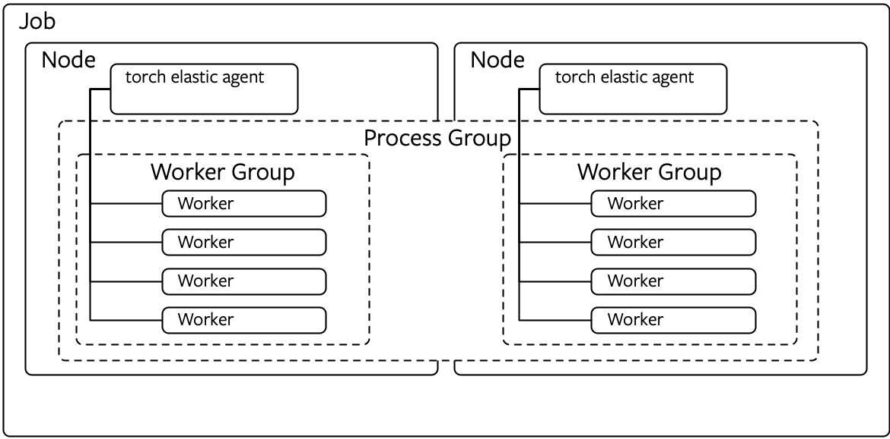

# TorchElastic原理

## 1. pytorch分布式训练

### 1.1 基本概念

`torch.distributed`中的功能可以分为三个主要组件：

- [分布式数据并行训练](https://pytorch.org/docs/master/generated/torch.nn.parallel.DistributedDataParallel.html)（DDP）是一种广泛采用的单程序多数据训练范例。 使用 DDP，可以在每个流程上复制模型，并且每个模型副本都将获得一组不同的输入数据样本。 DDP 负责梯度通信，以保持模型副本同步，并使其与梯度计算重叠，以加快训练速度。
- [基于 RPC 的分布式训练](https://pytorch.org/docs/master/rpc.html)（RPC）开发来支持无法适应数据并行训练的常规训练结构，例如分布式管道并行性，参数服务器范式以及 DDP 与其他训练范式的组合。 
- [集体通信](https://pytorch.org/docs/stable/distributed.html)（c10d）库支持跨组内的进程发送张量。 它提供了集体通信 API（例如[`all_reduce`](https://pytorch.org/docs/stable/distributed.html#torch.distributed.all_reduce)和[`all_gather`](https://pytorch.org/docs/stable/distributed.html#torch.distributed.all_gather)）和 P2P 通信 API（例如[`send`](https://pytorch.org/docs/stable/distributed.html#torch.distributed.send)和 [`isend`](https://pytorch.org/docs/stable/distributed.html#torch.distributed.isend)）。 从 v1.6.0 开始，DDP 和 RPC（[ProcessGroup 后端](https://pytorch.org/docs/master/rpc.html#process-group-backend)）建立在 c10d 上，其中前者使用集体通信，而后者使用 P2P 通信。

首先了解分布式数据并行（DDP）。假设以两台机器，每台机器8张显卡为例。DDP主要工作如下：

- 在DDP模式下，会有16个进程被启动，每个进程在一张卡上加载一个模型，这些模型的参数在数值上是相同的。即在16张显卡，16的并行数下，DDP会同时启动16个进程。

- 在模型训练时，各个进程通过Ring-Reduce方法与其他进程通讯，交换各自的梯度，从而获得所有进程的梯度；（各进程独立计算梯度， 每个进程将梯度依次传递给下一个进程，之后再把从上一个进程拿到的梯度传递给下一个进程。循环n次（进程数量）之后，所有进程就可以得到全部的梯度。每个进程只跟自己上下游两个进程进行通讯）

- 各个进程用平均后的梯度更新自己的参数，因为各个进程的初始参数、更新梯度是一致的，所以更新后的参数也是完全相同的。（实际上就是Data Parallelism）

一些参数和名词解释：

**group**

即进程组。默认情况下，只有一个组。

**world size**

表示全局的并行数，即2x8=16。

```python3
# 获取world size，在不同进程里都是一样的，得到16
torch.distributed.get_world_size()
```

**rank**

表现当前进程的序号，用于进程间通讯。对于16的world sizel来说，就是0,1,2,…,15。
注意：rank=0的进程就是master进程。

```text
# 获取rank，每个进程都有自己的序号，各不相同
torch.distributed.get_rank()
```

**local_rank**

每台机子上的进程的序号。机器一上有0,1,2,3,4,5,6,7，机器二上也有0,1,2,3,4,5,6,7

```python
# 获取local_rank。一般情况下，需要用local_rank来手动设置当前模型是跑在当前机器的哪块GPU上面的。
torch.distributed.local_rank()
```

### 1.2 使用ddp

```text
import torch.distributed as dist
from torch.nn.parallel import DistributedDataParallel as DDP
# 初始化DDP
dist.init_process_group(backend='nccl') 

# 加载数据，要在DDP初始化之后进行
# 使用DistributedSampler，保证每个进程数据不同
train_sampler = torch.utils.data.distributed.DistributedSampler(my_trainset)
# 需要注意的是，这里的batch_size指的是每个进程下的batch_size。
trainloader = torch.utils.data.DataLoader(my_trainset,
                                          batch_size=16, num_workers=2, 		   
                                          sampler=train_sampler)
...
# 构造DDP model
model = DDP(model, device_ids=[local_rank], output_device=local_rank)
...
```


### 1.3 运行方式

**单机模式**

```bash
## Bash运行
# 假设我们只在一台机器上运行，可用卡数是8
python -m torch.distributed.launch --nproc_per_node=1 ddp.py
```

**多机模式**

```bash
## Bash运行
# 假设我们在2台机器上运行，每台可用卡数是2
#    机器1：
python -m torch.distributed.launch --nnodes=2 --node_rank=0 --nproc_per_node 8 \
  --master_adderss $my_address --master_port $my_port ddp.py
#    机器2：
python -m torch.distributed.launch --nnodes=2 --node_rank=1 --nproc_per_node 8 \
  --master_adderss $my_address --master_port $my_port ddp.py
```

参数解释：

- --nnodes：有多少台机器
- --node_rank：当前机器编号（0，1，2，...）
- --nproc_per_node：每台机器有多少进程（显卡）
- --master_address：master进程的网络地址。（master进程就是rank=0的进程）

- --master_port：通讯的port，即master进程的端口。默认是29500

以服务器39.104.183.73作为master节点运行实例：

```
python -m torch.distributed.launch --nnodes=2 --node_rank=0 --nproc_per_node 1 --master_addr=192.168.64.237 --master_port=12346 ddp.py
# 在其他两台机器上运行：
python -m torch.distributed.launch --nnodes=2 --node_rank=1 --nproc_per_node 1 --master_addr=192.168.64.237 --master_port=12346 ddp.py
python -m torch.distributed.launch --nnodes=3 --node_rank=2 --nproc_per_node 1 --master_addr=192.168.64.237 --master_port=12346 ddp.py
```

另外，PyTorch也引入了torch.multiprocessing.spawn，可以使得单卡、DDP下的外部调用一致，即不用使用torch.distributed.launch。

### 1.4 ddp原理

#### 1.4.1 分布式概念

分布式系统相对于单机系统，最大的特征就是数据、处理是分布在不同的地方。与此相伴的是各节点间有交换数据的需求，为此需要定义交换数据的规范和接口，在此基础上，才能构建起分布式计算的框架。比如很有名的google大数据三驾马车之一的`map-reduce`概念，就是将数据分开成N份map到N个地方，并行进行处理；处理完成后，再将结果reduce到一起。

PyTorch在torch.distributed中提供了一些分布式的后端接口：gloo，mpi，nccl。

DDP利用`all_reduce`来进行不同进程上的梯度的平均操作。所谓的reduce，就是不同节点各有一份数据，把这些数据汇总到一起。在这里，我们规定各个节点上的这份数据有着相同的shape和data type，并规定汇总的方法是相加。所谓的`all_reduce`，就是在reduce的基础上，把最终的结果**发回到各个节点上。**

PyTorch提供了几个all_reduce的版本，最常使用的是Ring-Reduce版本。

```
def all_reduce(tensor,
               op=ReduceOp.SUM,
               group=group.WORLD,
               async_op=False):
```

#### 1.4.2 PyTorch 模型结构

- DDP下各进程不同步参数而是同步参数的变化量，所以各进程的模型的状态同一性是非常重要的。那么模型的状态由什么构成呢？

- DDP是怎么做到，无论是什么模型进来，一个简单的`model = DDP(model)`就可以解决问题呢？它的逻辑是怎么嵌入到模型中的？

1. module的组成：

   在PyTorch中，所有的模型都会继承module类。例如一个CNN模型，其就是由一系列module组合而成的。下面是module的初始化代码，可以看到它定义了一系列变量。可以说，这些变量就组成了一个module的基本要素。

   ```
   # torch.nn.modules.py. line 71. Class module:
       def __init__(self):
           """
           Initializes internal Module state, shared by both nn.Module and ScriptModule.
           """
           torch._C._log_api_usage_once("python.nn_module")
   
           self.training = True
           self._parameters = OrderedDict()
           self._buffers = OrderedDict()
           self._backward_hooks = OrderedDict()
           self._forward_hooks = OrderedDict()
           self._forward_pre_hooks = OrderedDict()
           self._state_dict_hooks = OrderedDict()
           self._load_state_dict_pre_hooks = OrderedDict()
           self._modules = OrderedDict()
   ```

   总的来说，module的基本要素可以分为2组，**一组是状态，一组是各种各样的hooks。**状态有以下4种：

   - self.training：指的是网络是否在训练状态中。
   - self._ modules：modules是下属的模块，相当于迭代地定义了self.trainig, self._ modules, self._parameters等一系列变量
   - self._parameters：指的就是网络的参数
   - **self._buffers**：不是参数，但也对网络很重要，会被持久化保存的数据。

   从本质上讲，当一个模型的网络结构被定义后，其状态就是由parameter和buffer的迭代组合表示的。当我们保存模型，调用`model.staic_dict()`的时候，我们同时会得到模型的parameter和buffer；也就是说，在DDP中，如果我们要在不同进程中维持相同的状态，我们不光要传递parameter的梯度，也要传递buffer。事实上，DDP就是这么做的。当每次网络传播开始前，其都会把master节点上的buffer广播给其他节点，维持状态的统一。

2. hook

   hook提供了一种机制：程序提供hook接口，用户可以写一个hook函数，然后钩在hook接口，即程序的主体上从而可以插入到中间执行。DDP使用hook技术把自己的逻辑插入到module的训练过程中去。

   Ring-Reduce机制就是通过hook机制插入到module中。parameter在反向梯度计算结束后提供了一个hook接口。DDP把Ring-Reduce的代码写成一个hook函数，插入到这里。每次parameter的反向梯度计算结束后，程序就会调用这个hook函数，从而开启Ring-Reduce流程。因为所有模型都用到parameter，所以DDP模型用hook函数就解决了所有模型的梯度平均问题了。

#### 1.4.3 ddp实现原理

**准备阶段**

1. 环境准备（就是`init_process_group`这一步）。各个进程会在这一步，与master节点进行握手，建立连接。如果连接上的进程数量不足约定的 word_size，进程会一直等待。也就是说，如果约定了`world_size=16`，但是只开了1台8卡机器，那么程序会一直暂停在这个地方。

2. DDP初始化（也就是`model = DDP(model)`这一步）

3. 1. 把parameter，buffer从master节点传到其他节点，使所有进程上的状态一致。

   2. 1. 注释：DDP通过这一步保证所有进程的初始状态一致。所以，请确保在这一步之后，代码不会再修改模型的任何东西，包括添加、修改、删除parameter和buffer！

   3. 如果有每个节点有多卡，则在每张卡上创建模型（类似DP）

   4. **把parameter进行分组，每一组称为一个bucket。**临近的parameter在同一个bucket。

   5. 1. 注释：这是为了加速，在梯度通讯时，先计算、得到梯度的bucket会马上进行通讯，不必等到所有梯度计算结束才进行通讯。后面会详细介绍。

   6. **创建管理器reducer，给每个parameter注册梯度平均的hook。**

   7. 为可能的SyncBN层做准备

**训练阶段**


在每个step中，DDP模型都会做下面的事情：

1. 采样数据，从dataloader得到一个batch的数据，用于当前计算（`for data, label in dataloader`）。因为使用了DistributedSampler，所以各个进程之间的数据是不会重复的。如果要确保DDP性能和单卡性能一致，需要保证在数据上DDP模式下的一个epoch和单卡下的一个epoch是等效的。

2. 进行网络的前向计算（`prediction = model(data)`）

3. 1. 同步各进程状态

   2. - 对单进程多卡复制模式，要在进程内同步多卡之间的parameter和buffer

   3. - 同步各进程之间的buffer。

   4. 进行前向计算

   5. （可能）当DDP参数find_unused_parameter为true时，其会在forward结束时，启动一个回溯，标记出所有没被用到的parameter，提前把这些设定为ready。（find_unused_parameter的默认值是false，因为其会拖慢速度。）

4. 计算梯度（`loss.backward()`）

5. 1. reducer外面：各个进程各自开始反向地计算梯度。（梯度是反向计算的，所以最后面的参数反而是最先得到梯度的。）

   2. reducer外面：当某个parameter的梯度计算好了的时候，其之前注册的grad hook就会被触发，在reducer里把这个parameter的状态标记为ready。

   3. reducer里面：当某个bucket的所有parameter都是ready状态时，reducer会开始对这个bucket的所有parameter都开始一个异步的all-reduce梯度平均操作。

   4. 1. - bucket的执行过程也是有顺序的，其顺序与parameter是相反的，即最先注册的parameter的bucket在最后面。

      2. - 所以，我们在创建module的时候，请务必把先进行计算的parameter注册在前面，后计算的在后面。不然，reducer会卡在某一个bucket等待，使训练时间延长！

      3. 1. （所谓的参数注册，其实就是创建网络层。也就是要求按照网络计算顺序，依次创建网络层。）

   5. reducer里面：当所有bucket的梯度平均都结束后，reducer才会把得到的平均grad结果正式写入到parameter.grad里面。（这一步，感觉没有必要等全部结束之后才进行。可能得对照一下源码。）

6. 优化器optimizer应用gradient，更新参数（`optimizer.step()`）。

虽然DDP的实现代码与optimizer没有关系，但是关于optimizer有个额外的东西需要说明。**更新后的参数最终能在各进程间保持一致，是由以下因素保证的：**

1. **参数初始值相同**

2. **参数更新值相同**

3. 1. 更新值相同又是由以下因素保证的：

   2. 1. optimizer初始状态相同
      2. 每次`opimizer.step()`时的梯度相同。

因为optimizer和DDP是没有关系的，所以**optimizer初始状态的同一性是不被DDP保证的！**大多数官方optimizer，其实现能保证从同样状态的model初始化时，其初始状态是相同的。所以这边我们只要保证在DDP模型创建后才初始化optimizer，就不用做额外的操作。**但是，如果自定义optimizer，则需要你自己来保证其统一性！**

```python
# 造DDP model
model = DDP(model, device_ids=[local_rank], output_device=local_rank)

# 要在构造DDP model之后，才能初始化model。
optimizer = optim.SGD(model.parameters(), lr=0.001, momentum=0.8)
```

#### 1.4.4 ddp源码

源码解读：https://zhuanlan.zhihu.com/p/343951042


## 2. TorchElastic

### 2.1 TorchElastic概念

随着应用复杂性和规模的增长，故障恢复成为当务之急。 有时，使用 DDP 时不可避免地会遇到 OOM 之类的错误，但是 DDP 本身无法从这些错误中恢复，基本的`try-except`块也无法工作。 这是因为 DDP 要求所有进程以紧密同步的方式运行，并且在不同进程中启动的所有`AllReduce`通信都必须匹配。 如果组中的某个进程抛出 OOM 异常，则很可能导致不同步（`AllReduce`操作不匹配），从而导致崩溃或挂起。

使用TorchElastic可以让PyTorch分布式训练具备弹性伸缩与自动容错的能力：

- 容错(Fault Tolerance): 当分布式训练中某个worker发生异常错误(如机器宕机)、高优先级任务抢占资源等情况时，支持worker重启或转移而不需要停止训练；
- 弹性(Elastic): 可以先运行在最小资源集合下，当有更多空闲资源时，可以动态扩容worker数运行在更多的资源上以便提升训练效率；当部分资源因某些原因要释放时，也可以动态缩容worker数释放占用的部分资源。即在任务启动时可以指定worker的数量上限以及下限，任何节点一个新的worker均可以加入或脱离已有训练任务的进程池中。一旦成员发生变化，无论是新增worker还是移除worker，任务所有的worker会重新进行一次协商，建立新的进程组，然后从之前某个良好的还原点恢复整个训练。


### 2.2 TorchElastic原理

主要由两部分组成：Elastic Agent 和 etcd。etcd主要用于配置共享和服务发现.

Elastic 主要的原理是在每一个正在跑 pytorch 分布式任务的 node 上，会有一个代理进程（下称 agent） 不断地去观测 node 上分布式任务进程的状态，然后把状态上报到一个 key-value 的 server 上，默认使用的是 etcd。


#### 2.2.1 Elastic Agent

TorchElastic使用elastic-agent进程，每个job的每个node会有一个单独的elastic-agent。每个agent只负责管理本地node上的所有worker,并保持与其他组内的elatic-agent协同。（其他 node 上的进程死掉了，rank 和 world_size 应该怎么变化）。一般来说每个节点node都会部署一个以本地进程形式运行的Agent，Agent之间能够通过etcd保持协同工作。示意图如下：



**Elastic Agent** 的作用:

- 与PyTorch原生分布式协同工作: 每个worker都能获得分布式训练框架所需的所有信息，以便 **torch.distributed.init_process_group()** 能成功的执行
- 容错：监控每个worker，当出现错误或者异常时能及时终止worker并重启恢复它们
- 弹性：跟随节点成员的变化，重启workers实现新成员的加入或者旧成员的退出

不同 node 的关系是这样处理的，如果有一个 node 上的 worker 出现了错误，这个 node 的 agent 会去重新启动这些 worker，如果是这个节点出了问题，就是agent 也没有了响应，需要更加高层的 owner 去管理 （默认是 k8s，所以 elastic 也实现了管理 elasticjob CRD 的 controller）。这些信息都会同步到对应的 world_size 和 rank 上，所以 training script 可能更新的时候需要确认world_size 和 rank 没有被改变。

当 job 起来之后，训练进程（下称 process）会自己跑自己的训练代码，跟没有 agent 一样，只是在开始的时候 agent 会把原来一些 **torch.distributed.launch** 做的工作做了，然后传给训练的进程。agent 会定时触发一个monitor_interval的验证流程（默认是 30s 触发一次），查看process的状态，如果没有报错，会作一次 rendezvous 的动作，同时会同步现在进程的状态（下称status）到 monitor 上。

node 上 training process 报错

如果 node 上一个或者多个 process 报错，agent 会重启这个 node 下所有的 process。训练代码需要自己完成加载最近 checkpoint 功能。agent 会把 monitor 上的 status 同步到该 node 上所有的process （如 epoch, optimizer, accuracy 等），继续原来的训练。所以在重启的worker 会一直跑，跑到分布式的 all_reduce的时候，一起更新权重这样权重就一致了， 然后state.epoch 下也会在新的一次 epoch 更新一致。

node/agent 报错

如果是 node 或者是 node 上 agent 报错，上述的 rendezvous 动作会被阻塞（ barrier），如果阻塞的时间在允许范围内重新连接了，rendezvous 会继续。如果时间超过允许范围了，会从这个 job 中排除这个 node，然后重启所有 node 上所有的 processes。读取对应的 checkpoint，和根据 monitor state 恢复最近checkpoint 的状态。


当worker成员发生变更会按照以下流程进行处理：当一个woker进程失败之后，对应的elastic_agent会将当前node上的所有worker进程都kill，然后根据其他agent建立协商通信，根据这些协商信息重启当前node上的所有woker。然而，如果一个agent 非零退出了，这就需要上报给上层调度模块比如kubernetes来拉起这个agent（同理这个agent会负责启动它所负责的所有worker）。所有节点层面的恢复逻辑都是一致的。类似k8s这样的编排工具将会调度一个job以至于最小replicas的agent运行，然后每个agent运行用户的训练脚本。


在TorchElastic中，使用Rendezvous作为对等发现的分布式同步机制，用于同步、收集各个worker的信息，包括节点列表、各节点worker角色等，各个Agent共同决定训练的开始、结束、恢复等。

以下是Rendezvous的状态描述图：


Rendezvous有下面几种特性：

**Barrier**

当worker执行rendenzvous时会被block直到rendenzvous完成，这个一般发生在等待最小集的节点(nnodes->MIN_SIZE)加入时。
当然，如果达到最小节点数要求后，也不会立刻进入完成，会再等待一小段时间，防止有部分节点因为某些原因启动慢了一点儿错过加入时间。当然如果MAX_SIZE达到，将会立刻进入rendenzvous完成。
另外，还有一个超时时间使得rendenzvous进入失败，如果在超时时间内，节点没有达到最小要求数。这个设定可以避免因为某些因素worker未能启动成功而造成资源浪费。

**Exclusivity**

需要确保在同一时刻，只有一个相同的任务集合在跑，Rendezvous能确保新节点加入时，不会独立形成一个新的任务在独立运行，而是等待加入正在运行的任务集合。

**Consistency**

当rendezvous一旦完成时，所以节点成员都能保持对成员组成列表的一致性和各个成员角色的一致性。在这里的角色就是一个整数，叫做 **rank** ，范围在0至world size。
需要注意的是， **rank** 对于worker来说不是一个固定的数，每次重新rendezvous时，这个数字都可能会变化。

**Fault-tolerance**

有两个阶段的容错机制：

- 当正在进行rendezvous过程中时，如果进程崩溃、网络丢失等发生时，会触发重新的rendezvous，而不会导致整个过程失败。
- worker训练过程中发生错误时，错误将会被TorchElastic的 **train_loop** 捕获，同样会触发重新的rendezvous，而不会导致训练中断

**Shared key-value store**:共享键值存储

When the rendezvous is completed, a shared key-value store is created and returned. This store implements a `torch.distributed.Store` API (see [distributed communication docs](https://pytorch.org/docs/stable/distributed.html)).

rendezvous完成后，创建并返回一个共享键值存储区。这个存储实现了一个torch.distributed。存储 API (参见分布式通信文档)。

This store is only shared by the members of the completed rendezvous. It is intended to be used by torchelastic to exchange information necessary to initialize job control and data-planes.

此存储区只由已完成rendezvous的成员共享。它是用来交换初始化作业控制和数据平面所必需的信息。

**Waiting workers and rendezvous closing**:正在等待的worker和rendezvous地点:

Torchelastic rendezvous handler object provides additional functionalities, which are technically not part of the rendezvous process:

torchelastic rendezvous处理程序对象提供了附加功能，这在技术上不是rendezvous过程的一部分:

1. Querying how many workers arrived late at the barrier, who can participate in *next* rendezvous.

   询问有多少worker到达barrier晚了，谁可以参加下一个rendezvous。

2. Setting the rendezvous *closed* to signal all workers not to participate in next rendezvous.

   设置rendezvous关闭，通知所有worker不要参加下一个rendezvous。


